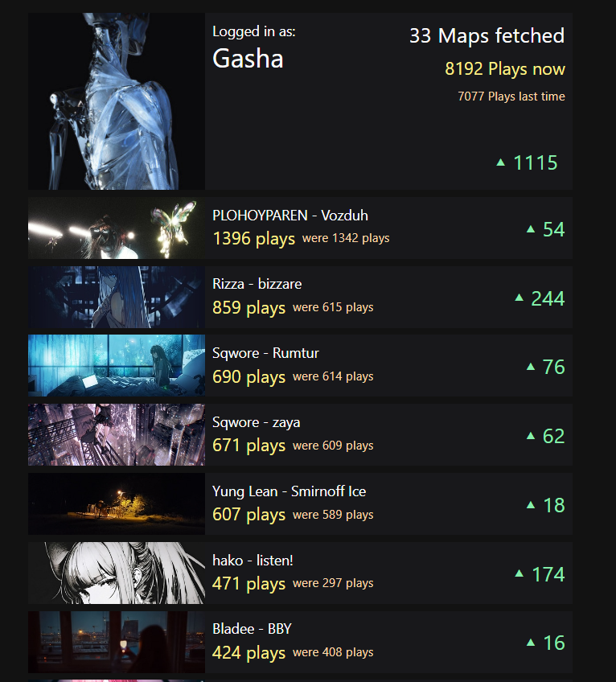

# Map playcount monitor

A web application that connects to the osu! API and allows you to see the playcount of your [osu!](https://osu.ppy.sh/home) maps and daily increase of it, for each map separately and an increase in the total number of plays on all maps. 

## Technologies Used

- **Next.js**: A powerful React framework for building fast and efficient web applications.
- **Redux**: A state management library for managing complex application states.
- **Tailwind CSS**: A utility-first CSS framework for building responsive and customizable user interfaces.
- **osu! API**: The official API for retrieving osu! game data, including user profiles and beatmap details.
- **Local Storage**: Used to store and manage user preferences and data on the client-side.

## Appearance

